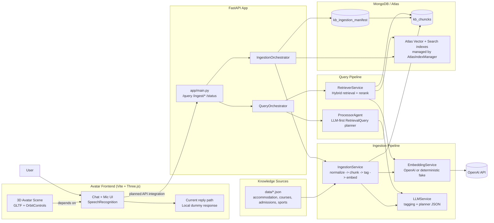
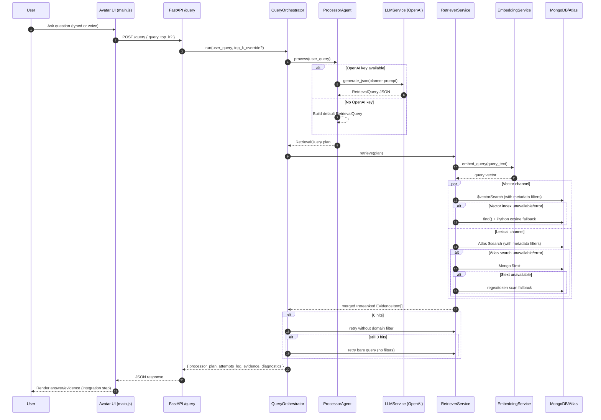

# System Diagram

This project is building a **Loughborough Open Day assistant**: a RAG backend over university data, with a 3D avatar chat UI.

## Current state reflected by code
- Backend RAG pipeline is implemented end-to-end (`app/`, `services/`, `agents/`).
- Query path: `ProcessorAgent` plans structured retrieval, then `RetrieverService` executes hybrid search with fallbacks.
- Ingestion path: JSON sources are chunked, tagged, embedded, and upserted into Mongo with source manifests for incremental runs.
- Avatar frontend currently uses local dummy responses and is **not yet connected** to `POST /query`.

## Runtime Query Sequence

