# System Architecture Diagrams

This project is a Loughborough Open Day assistant with four connected components:

- a FastAPI backend with query, feedback, and ingestion endpoints
- a MongoDB Atlas knowledge base with vector and lexical indexes
- a multi-agent RAG runtime with evaluator-in-the-loop control and a feedback retry path
- a Vite + Three.js avatar UI with speech, markdown rendering, and feedback buttons

---

## 1. System Landscape

High-level view of every component and how data moves between them.

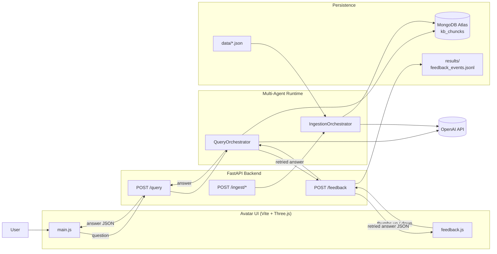
```mermaid
flowchart LR
    subgraph Frontend["Avatar UI (Vite + Three.js)"]
        UI[main.js]
        FB[feedback.js]
    end

    subgraph Backend["FastAPI Backend"]
        QAPI["POST /query"]
        FAPI["POST /feedback"]
        IAPI["POST /ingest/*"]
    end

    subgraph Runtime["Multi-Agent Runtime"]
        QO[QueryOrchestrator]
        IO[IngestionOrchestrator]
    end

    subgraph Store["Persistence"]
        KB[(MongoDB Atlas\nkb_chuncks)]
        LOG[results/\nfeedback_events.jsonl]
        DATA[data/*.json]
    end

    OAI[(OpenAI API)]

    User --> UI
    UI -->|question| QAPI
    FB -->|thumbs up / down| FAPI

    QAPI --> QO
    FAPI --> QO
    QO --> OAI
    QO --> KB

    IAPI --> IO
    DATA --> IO
    IO --> OAI
    IO --> KB

    FAPI --> LOG

    QO -->|answer| QAPI
    QO -->|retried answer| FAPI
    QAPI -->|answer JSON| UI
    FAPI -->|retried answer JSON| FB
```

---

## 2. Runtime Query Flow

End-to-end path from a user question to a final answer.

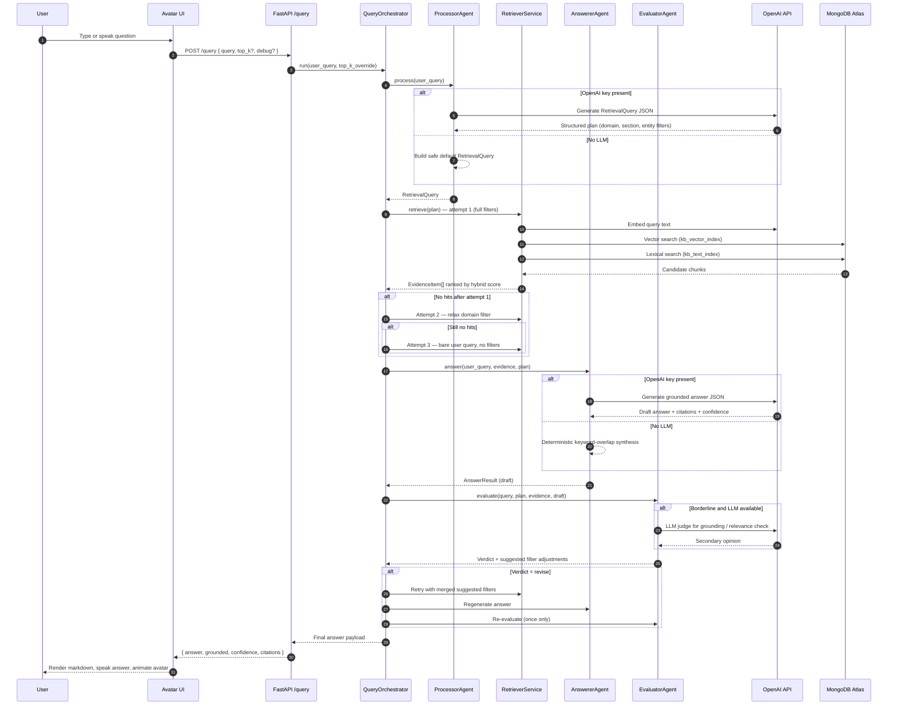
```mermaid
sequenceDiagram
    autonumber
    participant User
    participant UI as Avatar UI
    participant API as FastAPI /query
    participant QO as QueryOrchestrator
    participant PA as ProcessorAgent
    participant RS as RetrieverService
    participant AA as AnswererAgent
    participant EV as EvaluatorAgent
    participant LLM as OpenAI API
    participant DB as MongoDB Atlas

    User->>UI: Type or speak question
    UI->>API: POST /query { query, top_k?, debug? }
    API->>QO: run(user_query, top_k_override)

    QO->>PA: process(user_query)
    alt OpenAI key present
        PA->>LLM: Generate RetrievalQuery JSON
        LLM-->>PA: Structured plan (domain, section, entity filters)
    else No LLM
        PA-->>PA: Build safe default RetrievalQuery
    end
    PA-->>QO: RetrievalQuery

    QO->>RS: retrieve(plan) — attempt 1 (full filters)
    RS->>LLM: Embed query text
    RS->>DB: Vector search (kb_vector_index)
    RS->>DB: Lexical search (kb_text_index)
    DB-->>RS: Candidate chunks
    RS-->>QO: EvidenceItem[] ranked by hybrid score

    alt No hits after attempt 1
        QO->>RS: Attempt 2 — relax domain filter
        alt Still no hits
            QO->>RS: Attempt 3 — bare user query, no filters
        end
    end

    QO->>AA: answer(user_query, evidence, plan)
    alt OpenAI key present
        AA->>LLM: Generate grounded answer JSON
        LLM-->>AA: Draft answer + citations + confidence
    else No LLM
        AA-->>AA: Deterministic keyword-overlap synthesis
    end
    AA-->>QO: AnswerResult (draft)

    QO->>EV: evaluate(query, plan, evidence, draft)
    alt Borderline and LLM available
        EV->>LLM: LLM judge for grounding / relevance check
        LLM-->>EV: Secondary opinion
    end
    EV-->>QO: Verdict + suggested filter adjustments

    alt Verdict = revise
        QO->>RS: Retry with merged suggested filters
        QO->>AA: Regenerate answer
        QO->>EV: Re-evaluate (once only)
    end

    QO-->>API: Final answer payload
    API-->>UI: { answer, grounded, confidence, citations }
    UI-->>User: Render markdown, speak answer, animate avatar
```

---

## 3. Feedback Loop

What happens when a user clicks "No, my question wasn't answered."

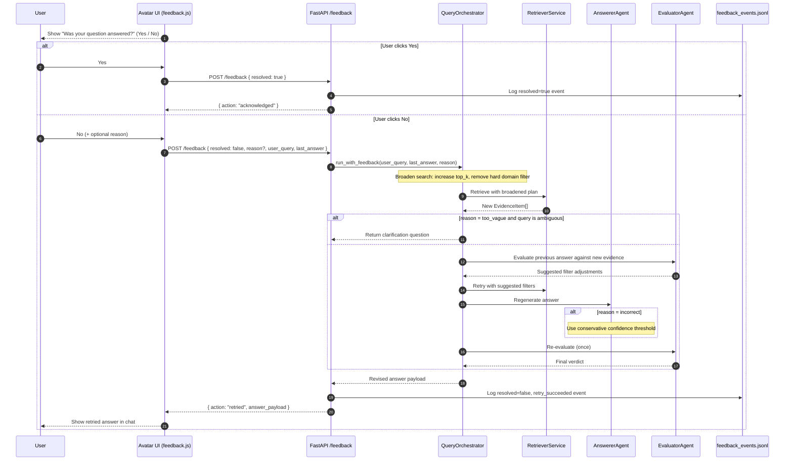
```mermaid
sequenceDiagram
    autonumber
    participant User
    participant UI as Avatar UI (feedback.js)
    participant API as FastAPI /feedback
    participant QO as QueryOrchestrator
    participant RS as RetrieverService
    participant AA as AnswererAgent
    participant EV as EvaluatorAgent
    participant LOG as feedback_events.jsonl

    UI-->>User: Show "Was your question answered?" (Yes / No)

    alt User clicks Yes
        User->>UI: Yes
        UI->>API: POST /feedback { resolved: true }
        API->>LOG: Log resolved=true event
        API-->>UI: { action: "acknowledged" }
    else User clicks No
        User->>UI: No (+ optional reason)
        UI->>API: POST /feedback { resolved: false, reason?, user_query, last_answer }
        API->>QO: run_with_feedback(user_query, last_answer, reason)

        Note over QO: Broaden search: increase top_k, remove hard domain filter

        QO->>RS: Retrieve with broadened plan
        RS-->>QO: New EvidenceItem[]

        alt reason = too_vague and query is ambiguous
            QO-->>API: Return clarification question
        else
            QO->>EV: Evaluate previous answer against new evidence
            EV-->>QO: Suggested filter adjustments

            QO->>RS: Retry with suggested filters
            QO->>AA: Regenerate answer
            alt reason = incorrect
                Note over AA: Use conservative confidence threshold
            end
            QO->>EV: Re-evaluate (once)
            EV-->>QO: Final verdict
        end

        QO-->>API: Revised answer payload
        API->>LOG: Log resolved=false, retry_succeeded event
        API-->>UI: { action: "retried", answer_payload }
        UI-->>User: Show retried answer in chat
    end
```

---

## 4. Agent Interaction and Evaluator Verdicts

How the four runtime components interact and what the evaluator can decide.

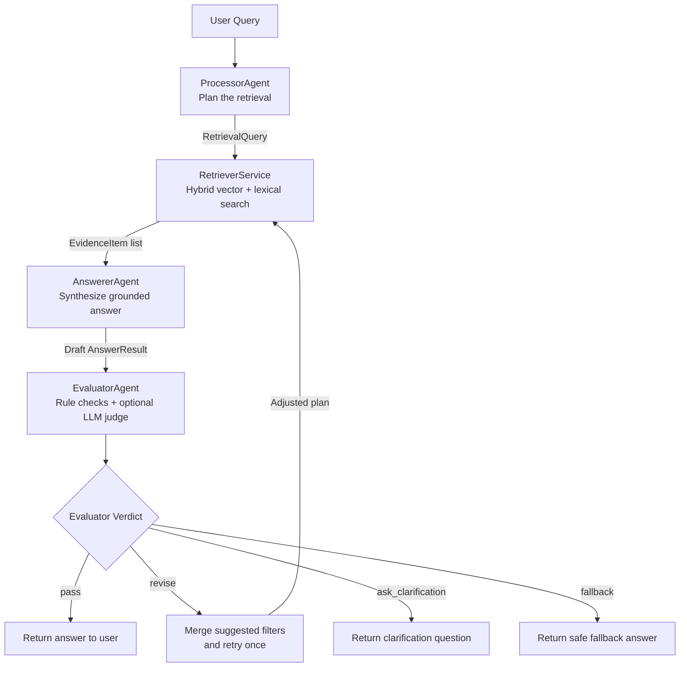
```mermaid
flowchart TD
    Q[User Query]
    PA[ProcessorAgent\nPlan the retrieval]
    RS[RetrieverService\nHybrid vector + lexical search]
    AA[AnswererAgent\nSynthesize grounded answer]
    EV[EvaluatorAgent\nRule checks + optional LLM judge]
    D{Evaluator Verdict}

    PASS[Return answer to user]
    REV[Merge suggested filters\nand retry once]
    ASK[Return clarification question]
    FALL[Return safe fallback answer]

    Q --> PA
    PA -->|RetrievalQuery| RS
    RS -->|EvidenceItem list| AA
    AA -->|Draft AnswerResult| EV
    EV --> D

    D -->|pass| PASS
    D -->|revise| REV
    D -->|ask_clarification| ASK
    D -->|fallback| FALL

    REV -->|Adjusted plan| RS
```

---

## 5. Evaluator Decision Pipeline

How the EvaluatorAgent decides what verdict to return.

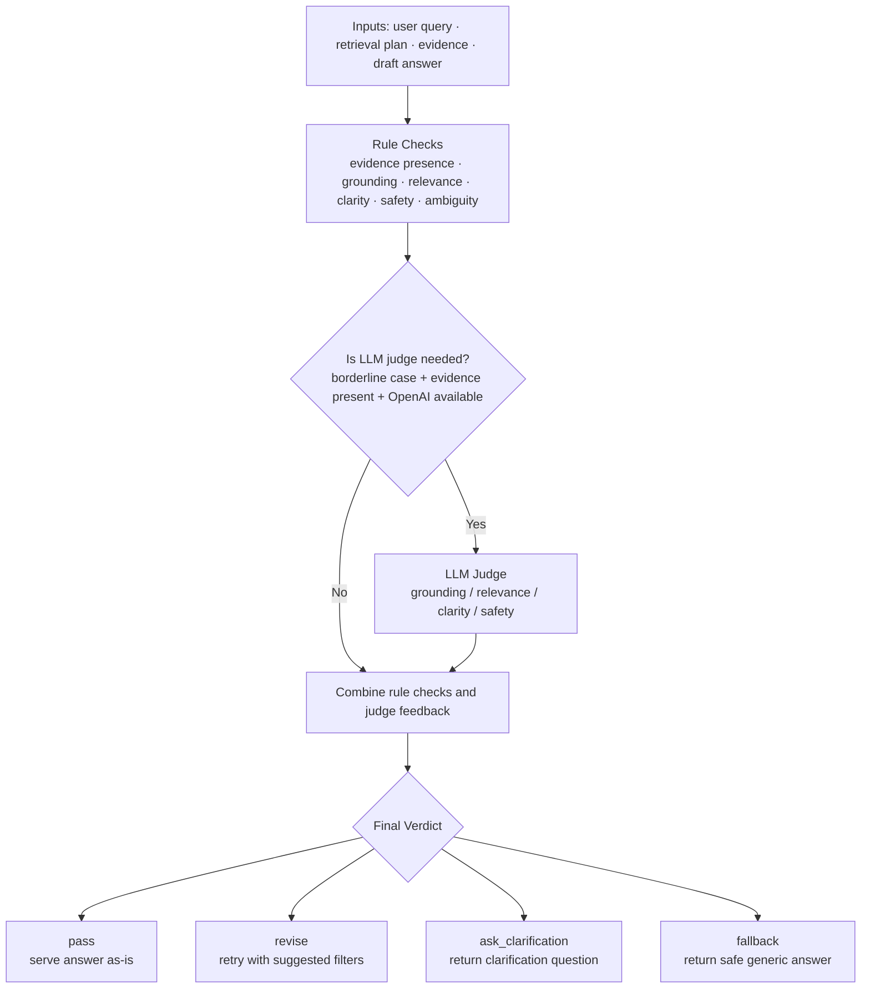
```mermaid
flowchart TD
    IN[Inputs: user query · retrieval plan · evidence · draft answer]

    RC[Rule Checks\nevidence presence · grounding · relevance · clarity · safety · ambiguity]

    J{Is LLM judge needed?\nborderline case + evidence present + OpenAI available}

    LLM[LLM Judge\ngrounding / relevance / clarity / safety]

    COMB[Combine rule checks and judge feedback]

    V{Final Verdict}

    PASS[pass\nserve answer as-is]
    REV[revise\nretry with suggested filters]
    ASK[ask_clarification\nreturn clarification question]
    FALL[fallback\nreturn safe generic answer]

    IN --> RC
    RC --> J
    J -->|Yes| LLM
    J -->|No| COMB
    LLM --> COMB
    COMB --> V

    V --> PASS
    V --> REV
    V --> ASK
    V --> FALL
```

### What the Evaluator Checks

| Check | What it looks for |
|---|---|
| Evidence presence | At least one evidence item returned |
| Evidence strength | Top score ≥ 0.45, average of top 3 ≥ 0.30 |
| Grounding | Citations reference real evidence IDs; numeric claims appear in evidence |
| Answer-evidence overlap | At least 5 % token overlap |
| Relevance | Query focus tokens appear in answer |
| Clarity | Answer ≥ 24 characters; no vague stock phrases |
| Safety | Overconfident language with weak evidence is rejected |
| Ambiguity | Too few focus tokens or pronoun-heavy query triggers clarification |

---

## 6. Retrieval Strategy

Three-level fallback inside RetrieverService to maximise hit rate.

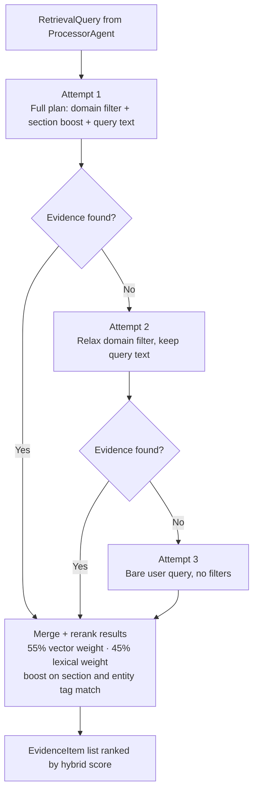
```mermaid
flowchart TD
    P[RetrievalQuery from ProcessorAgent]

    A1[Attempt 1\nFull plan: domain filter + section boost + query text]
    HIT1{Evidence found?}

    A2[Attempt 2\nRelax domain filter, keep query text]
    HIT2{Evidence found?}

    A3[Attempt 3\nBare user query, no filters]

    MERGE[Merge + rerank results\n55% vector weight · 45% lexical weight\nboost on section and entity tag match]

    OUT[EvidenceItem list ranked by hybrid score]

    P --> A1
    A1 --> HIT1
    HIT1 -->|Yes| MERGE
    HIT1 -->|No| A2
    A2 --> HIT2
    HIT2 -->|Yes| MERGE
    HIT2 -->|No| A3
    A3 --> MERGE
    MERGE --> OUT
```

---

## 7. Ingestion and Knowledge Base Flow

How source JSON files become searchable chunks in MongoDB.

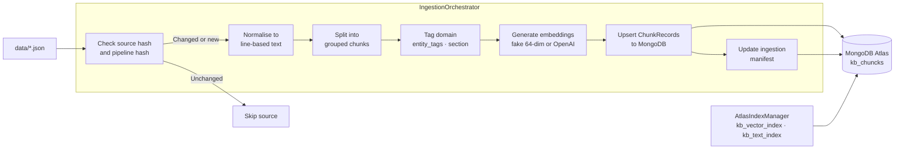
```mermaid
flowchart LR
    JSON[data/*.json]

    subgraph IO [IngestionOrchestrator]
        HASH[Check source hash\nand pipeline hash]
        NORM[Normalise to\nline-based text]
        CHUNK[Split into\ngrouped chunks]
        TAG[Tag domain\nentity_tags · section]
        EMBED[Generate embeddings\nfake 64-dim or OpenAI]
        UPSERT[Upsert ChunkRecords\nto MongoDB]
        MAN[Update ingestion\nmanifest]
    end

    KB[(MongoDB Atlas\nkb_chuncks)]
    IDX[AtlasIndexManager\nkb_vector_index · kb_text_index]

    JSON --> HASH
    HASH -->|Changed or new| NORM
    HASH -->|Unchanged| SKIP[Skip source]
    NORM --> CHUNK --> TAG --> EMBED --> UPSERT
    UPSERT --> KB
    UPSERT --> MAN
    MAN --> KB
    IDX --> KB
```

### Ingestion Notes

- Incremental ingestion: sources are skipped when their SHA-256 hash and the pipeline configuration hash have not changed.
- Tagging: either rule-based heuristics or an LLM-assisted classifier.
- Embeddings: deterministic 64-dimension fake vectors for local development; OpenAI `text-embedding-3-small` for production.

---

## 8. Avatar UI Component Flow

How the frontend wraps the backend answer and feedback flow.

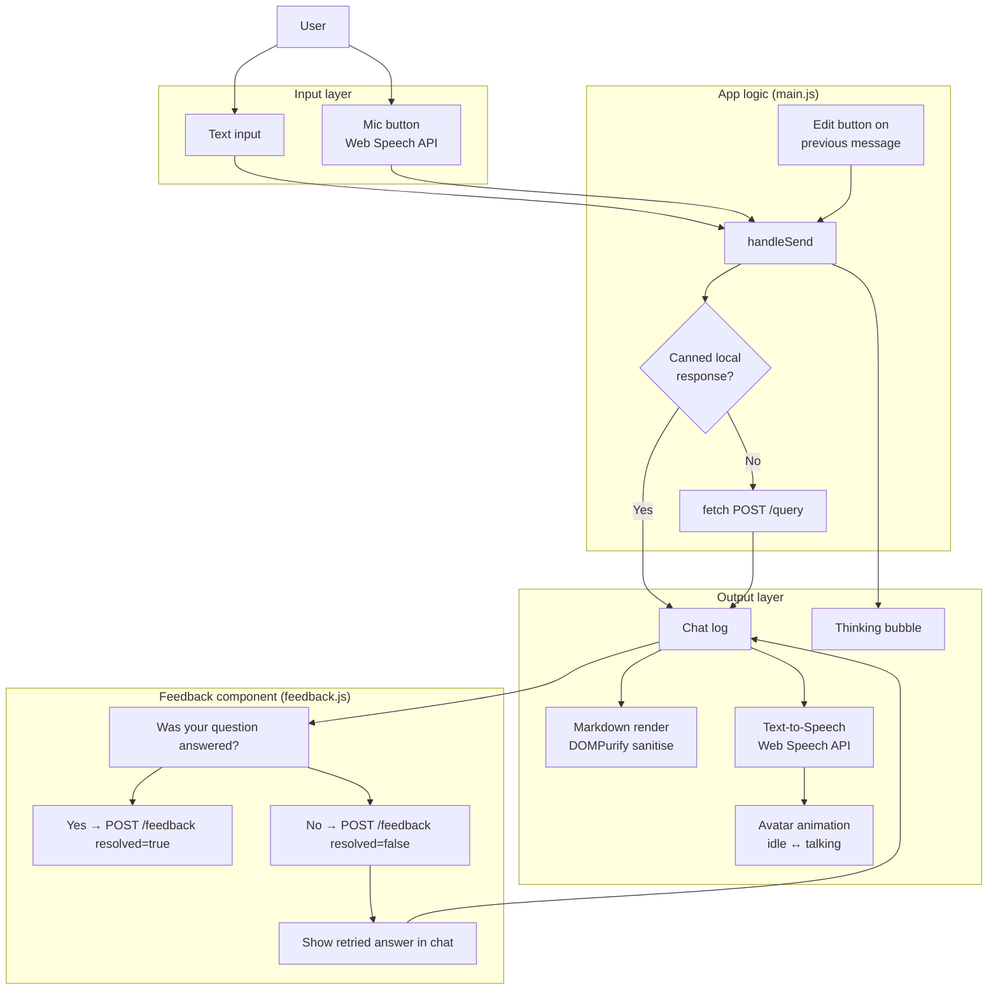
```mermaid
flowchart TD
    USER[User]

    subgraph Input["Input layer"]
        TXT[Text input]
        MIC[Mic button\nWeb Speech API]
    end

    subgraph Logic["App logic (main.js)"]
        SEND[handleSend]
        CANNED{Canned local\nresponse?}
        FETCH[fetch POST /query]
        EDIT[Edit button on\nprevious message]
    end

    subgraph Output["Output layer"]
        CHAT[Chat log]
        THINK[Thinking bubble]
        RENDER[Markdown render\nDOMPurify sanitise]
        TTS[Text-to-Speech\nWeb Speech API]
        AV[Avatar animation\nidle ↔ talking]
    end

    subgraph FeedbackUI["Feedback component (feedback.js)"]
        FROW["Was your question answered?"]
        YES[Yes → POST /feedback resolved=true]
        NO[No → POST /feedback resolved=false]
        RETRY[Show retried answer in chat]
    end

    USER --> TXT
    USER --> MIC
    TXT --> SEND
    MIC --> SEND
    SEND --> THINK
    SEND --> CANNED
    CANNED -->|Yes| CHAT
    CANNED -->|No| FETCH
    FETCH --> CHAT
    EDIT --> SEND

    CHAT --> RENDER
    CHAT --> TTS
    CHAT --> FROW
    TTS --> AV

    FROW --> YES
    FROW --> NO
    NO --> RETRY
    RETRY --> CHAT
```

---

## 9. API Response Shapes

`POST /query` has two output modes:

**Default (user-facing)**
```
{ query, answer, grounded, confidence, citations }
```

**Debug mode** (`debug=true`)
```
{
  query, answer, grounded, confidence, citations,
  processor_plan, retrieval_diagnostics,
  evaluator_result, orchestration_meta,
  timing: { processor_ms, retriever_ms, answerer_ms, evaluator_ms, total_ms }
}
```

`POST /feedback` returns:

| User action | `action` field | Extra field |
|---|---|---|
| Clicked Yes (resolved) | `"acknowledged"` | — |
| Clicked No (not resolved) | `"retried"` | `answer_payload` (same shape as default /query response) |

---

## 10. Offline Evaluation Flow

Scripts for measuring system quality outside of live serving.

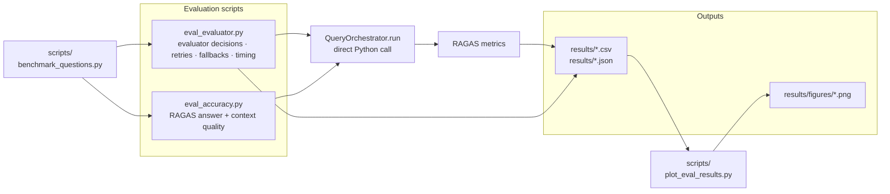
```mermaid
flowchart LR
    BENCH[scripts/\nbenchmark_questions.py]

    subgraph Eval["Evaluation scripts"]
        EE[eval_evaluator.py\nevaluator decisions · retries · fallbacks · timing]
        EA[eval_accuracy.py\nRAGAS answer + context quality]
    end

    ORCH[QueryOrchestrator.run\ndirect Python call]

    subgraph Results["Outputs"]
        OUT[results/*.csv\nresults/*.json]
        PNG[results/figures/*.png]
    end

    RAGAS[RAGAS metrics]
    PLOT[scripts/\nplot_eval_results.py]

    BENCH --> EE
    BENCH --> EA
    EE --> ORCH
    EA --> ORCH
    ORCH --> RAGAS
    RAGAS --> OUT
    EE --> OUT
    OUT --> PLOT
    PLOT --> PNG
```

---

## 11. Architecture Overview (Demo Summary)

One-line view of how a question travels through every layer.

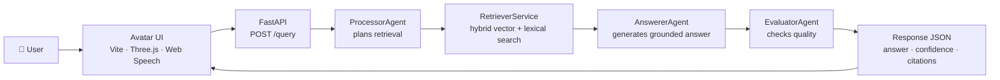
```mermaid
flowchart LR
    A["👤 User"] --> B["Avatar UI\nVite · Three.js · Web Speech"]
    B --> C["FastAPI\nPOST /query"]
    C --> D["ProcessorAgent\nplans retrieval"]
    D --> E["RetrieverService\nhybrid vector + lexical search"]
    E --> F["AnswererAgent\ngenerates grounded answer"]
    F --> G["EvaluatorAgent\nchecks quality"]
    G --> H["Response JSON\nanswer · confidence · citations"]
    H --> B
```

---

## 12. Simplified Query Sequence (Demo View)

Condensed flow — one participant per layer, key steps only.

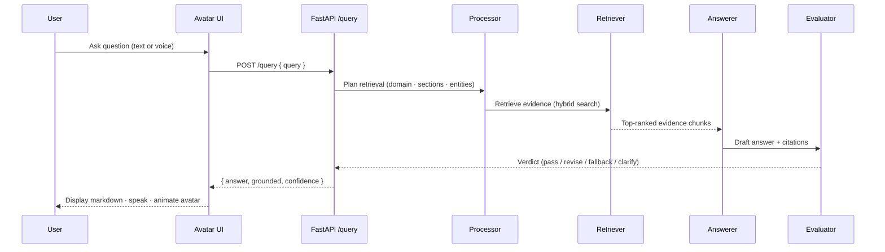
```mermaid
sequenceDiagram
    participant User
    participant UI as Avatar UI
    participant API as FastAPI /query
    participant PA as Processor
    participant RS as Retriever
    participant AA as Answerer
    participant EV as Evaluator

    User->>UI: Ask question (text or voice)
    UI->>API: POST /query { query }
    API->>PA: Plan retrieval (domain · sections · entities)
    PA->>RS: Retrieve evidence (hybrid search)
    RS-->>AA: Top-ranked evidence chunks
    AA->>EV: Draft answer + citations
    EV-->>API: Verdict (pass / revise / fallback / clarify)
    API-->>UI: { answer, grounded, confidence }
    UI-->>User: Display markdown · speak · animate avatar
```

---

## 13. Query Outcome Flowchart

What happens at each decision point from retrieval through to the final response.

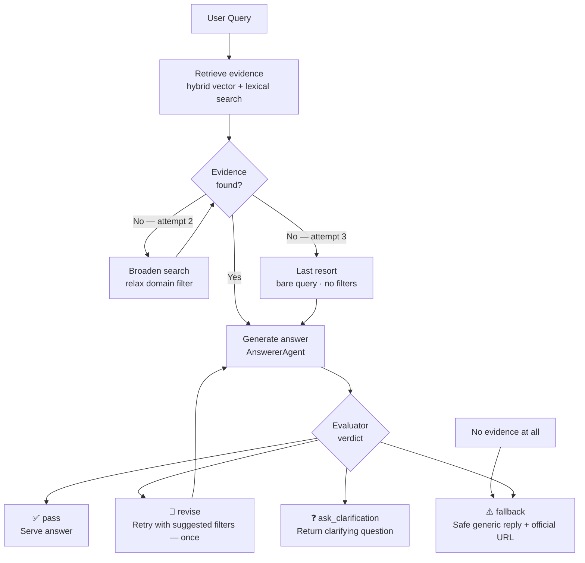
```mermaid
flowchart TD
    Q[User Query]
    RET[Retrieve evidence\nhybrid vector + lexical search]
    HIT{Evidence\nfound?}

    RELAX[Broaden search\nrelax domain filter]
    BARE[Last resort\nbare query · no filters]
    NOHIT[No evidence at all]

    GEN[Generate answer\nAnswererAgent]
    EVAL{Evaluator\nverdict}

    PASS["✅ pass\nServe answer"]
    REV["🔄 revise\nRetry with suggested filters — once"]
    ASK["❓ ask_clarification\nReturn clarifying question"]
    FALL["⚠️ fallback\nSafe generic reply + official URL"]

    Q --> RET
    RET --> HIT
    HIT -->|Yes| GEN
    HIT -->|No — attempt 2| RELAX
    RELAX --> HIT
    HIT -->|No — attempt 3| BARE
    BARE --> GEN
    NOHIT --> FALL

    GEN --> EVAL
    EVAL --> PASS
    EVAL --> REV
    REV --> GEN
    EVAL --> ASK
    EVAL --> FALL
```

---

## 14. Example Query Trace

Step-by-step trace for: *"How much is Butler Court per week?"*

| Stage | Output |
|---|---|
| **User query** | "How much is Butler Court per week?" |
| **ProcessorAgent** | domain: `accommodation` · section: `pricing` · entity\_tags: `["butler court"]` · query\_text: "Butler Court weekly price" |
| **RetrieverService** | Attempt 1 — vector + lexical search with domain filter → returns 5 accommodation chunks including Butler Court pricing row |
| **AnswererAgent** | Draft: "Butler Court costs £XXX per week, with a contract length of XX weeks." · grounded: `true` · confidence: `0.92` · citations: `[chunk_id_abc]` |
| **EvaluatorAgent** | evidence\_present: ✅ · grounded: ✅ · relevant: ✅ · clear: ✅ · safe: ✅ · **verdict: pass** |
| **Response to UI** | Answer displayed in chat, spoken aloud by TTS, avatar switches to talking animation |

---

## 15. Evaluation Table

Representative questions covering each domain, with expected system behaviour.

| Question type | Example question | Expected behaviour | Evaluator verdict |
|---|---|---|---|
| **Accommodation — specific** | "How much does it cost to stay in Elvyn Hall?" | Exact weekly price + contract length from pricing data | pass |
| **Accommodation — comparison** | "What is the cheapest accommodation?" | Deterministic price-sort → cheapest hall name + weekly price | pass |
| **Accommodation — general** | "What accommodation options are available and when should I apply?" | Overview of halls, facilities, contract lengths, application timeline | pass |
| **Courses — entry requirements** | "What are the entry requirements for this course?" | A-level / UCAS points for the relevant degree | pass |
| **Courses — modules** | "What modules are compulsory and what options are available?" | Compulsory vs optional module list from course data | pass |
| **Courses — placements** | "Are there opportunities for placements, internships or year abroad?" | Placement year / internship options from course data | pass |
| **Finance — living costs** | "What are typical living costs in the area and on-campus?" | Indicative on-campus and off-campus cost ranges | pass |
| **Finance — scholarships** | "Are there scholarships, bursaries or financial support options?" | Scholarship names, eligibility, amounts | pass |
| **Support — wellbeing** | "What support services exist for mental health and wellbeing?" | Counselling, wellbeing teams, 24/7 helpline details | pass |
| **Support — international** | "Is there support for international students and visa advice?" | International student office, visa guidance, pre-arrival support | pass |
| **Campus life — societies** | "What student societies and clubs would you recommend for newcomers?" | Sports Union clubs, subject societies, social groups | pass |
| **Career — employability** | "What career support and employability services are available?" | Careers office, employer events, CV workshops | pass |
| **Ambiguous — triggers clarification** | "What does it cost?" | Evaluator detects ambiguity → clarification: "Do you mean tuition fees, accommodation, or something else?" | ask\_clarification |
| **Out-of-scope — triggers fallback** | "What is the weather today?" | No evidence found → safe fallback with official Loughborough URL | fallback |
