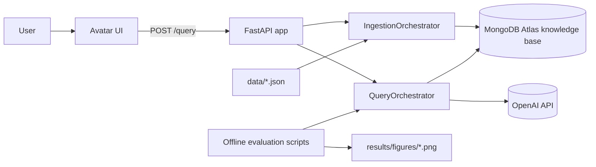
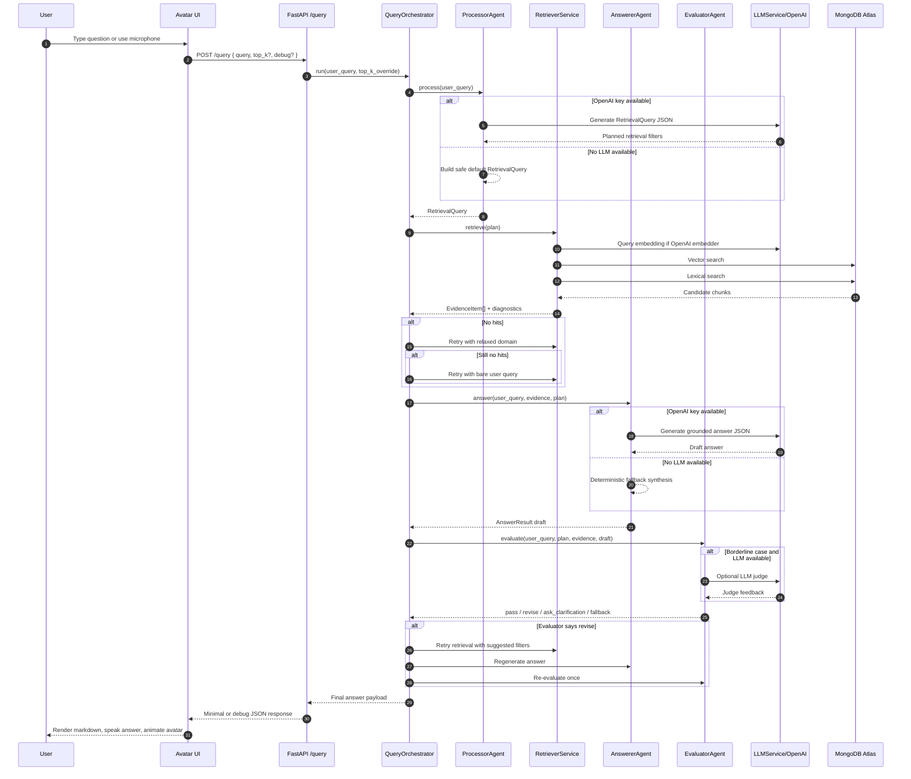
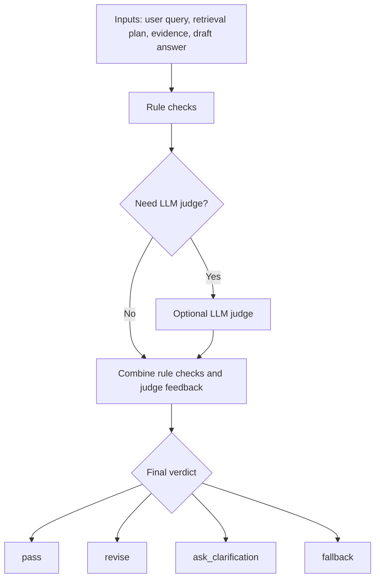
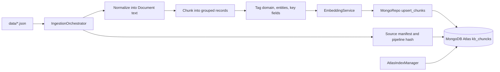
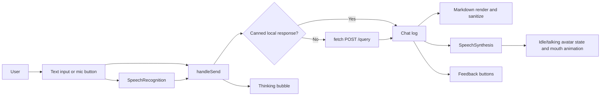
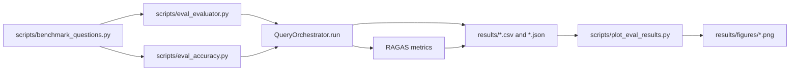
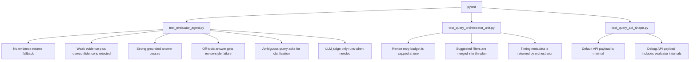

# System Diagram

This project is a Loughborough Open Day assistant with four connected parts:

- a FastAPI backend
- a MongoDB/Atlas knowledge base
- a multi-agent RAG runtime with evaluator-in-the-loop control
- a Vite + Three.js avatar UI

The diagrams below reflect the current codebase state.

## Current System Landscape

```mermaid
flowchart LR
    U[User]
    UI[Avatar UI]
    API[FastAPI app]
    QO[QueryOrchestrator]
    IO[IngestionOrchestrator]
    KB[(MongoDB Atlas knowledge base)]
    OAI[(OpenAI API)]
    DATA[data/*.json]
    EVAL[Offline evaluation scripts]
    FIGS[results/figures/*.png]

    U --> UI
    UI -->|POST /query| API
    API --> QO
    API --> IO

    DATA --> IO
    IO --> KB

    QO --> KB
    QO --> OAI

    EVAL --> QO
    EVAL --> FIGS
```

## Current State Reflected By Code

- The avatar frontend is connected to the backend now. `cs-avatar/src/main.js` sends real `POST /query` requests to FastAPI.
- The runtime query path is now `ProcessorAgent -> RetrieverService -> AnswererAgent -> EvaluatorAgent`, coordinated by `QueryOrchestrator`.
- The evaluator is part of the live serving path, not just offline testing.
- The orchestrator supports one evaluator-driven revise retry before choosing a final runtime action.
- `POST /query` returns a minimal user-facing payload by default, and a full multi-agent trace when `debug=true`.
- Offline evaluation scripts call `QueryOrchestrator.run()` directly rather than going through HTTP.
- Plotting scripts generate report figures into `results/figures/`.

## Runtime Query Flow: Endpoint To Final Answer

This is the end-to-end path a user follows from asking a question in the UI to receiving an answer.

```mermaid
sequenceDiagram
    autonumber
    participant User
    participant UI as Avatar UI
    participant API as FastAPI /query
    participant QO as QueryOrchestrator
    participant PA as ProcessorAgent
    participant RS as RetrieverService
    participant AA as AnswererAgent
    participant EV as EvaluatorAgent
    participant LLM as LLMService/OpenAI
    participant DB as MongoDB Atlas

    User->>UI: Type question or use microphone
    UI->>API: POST /query { query, top_k?, debug? }
    API->>QO: run(user_query, top_k_override)

    QO->>PA: process(user_query)
    alt OpenAI key available
        PA->>LLM: Generate RetrievalQuery JSON
        LLM-->>PA: Planned retrieval filters
    else No LLM available
        PA-->>PA: Build safe default RetrievalQuery
    end
    PA-->>QO: RetrievalQuery

    QO->>RS: retrieve(plan)
    RS->>LLM: Query embedding if OpenAI embedder
    RS->>DB: Vector search
    RS->>DB: Lexical search
    DB-->>RS: Candidate chunks
    RS-->>QO: EvidenceItem[] + diagnostics

    alt No hits
        QO->>RS: Retry with relaxed domain
        alt Still no hits
            QO->>RS: Retry with bare user query
        end
    end

    QO->>AA: answer(user_query, evidence, plan)
    alt OpenAI key available
        AA->>LLM: Generate grounded answer JSON
        LLM-->>AA: Draft answer
    else No LLM available
        AA-->>AA: Deterministic fallback synthesis
    end
    AA-->>QO: AnswerResult draft

    QO->>EV: evaluate(user_query, plan, evidence, draft)
    alt Borderline case and LLM available
        EV->>LLM: Optional LLM judge
        LLM-->>EV: Judge feedback
    end
    EV-->>QO: pass / revise / ask_clarification / fallback

    alt Evaluator says revise
        QO->>RS: Retry retrieval with suggested filters
        QO->>AA: Regenerate answer
        QO->>EV: Re-evaluate once
    end

    QO-->>API: Final answer payload
    API-->>UI: Minimal or debug JSON response
    UI-->>User: Render markdown, speak answer, animate avatar
```

## How The Agents Work Together

This is the live orchestration loop inside the backend.

```mermaid
flowchart TD
    Q[User query]
    P[ProcessorAgent]
    R[RetrieverService]
    A[AnswererAgent]
    E[EvaluatorAgent]
    D{Evaluator verdict}
    PASS[Return final answer]
    REV[Merge suggested filters and retry once]
    ASK[Return clarification question]
    FALL[Return safe fallback answer]

    Q --> P
    P -->|RetrievalQuery| R
    R -->|EvidenceItem[]| A
    A -->|Draft AnswerResult| E
    E --> D

    D -->|pass| PASS
    D -->|revise| REV
    D -->|ask_clarification| ASK
    D -->|fallback| FALL

    REV --> R
```

## Evaluator Inside The Runtime

The evaluator is the control gate between "draft answer" and "what the user actually sees."

```mermaid
flowchart TD
    IN[Inputs: user query, retrieval plan, evidence, draft answer]
    RULES[Rule checks]
    JUDGE{Need LLM judge?}
    LLMJ[Optional LLM judge]
    COMBINE[Combine rule checks and judge feedback]
    VERDICT{Final verdict}
    PASS[pass]
    REVISE[revise]
    CLARIFY[ask_clarification]
    SAFE[fallback]

    IN --> RULES
    RULES --> JUDGE
    JUDGE -->|Yes| LLMJ
    JUDGE -->|No| COMBINE
    LLMJ --> COMBINE
    COMBINE --> VERDICT

    VERDICT --> PASS
    VERDICT --> REVISE
    VERDICT --> CLARIFY
    VERDICT --> SAFE
```

### What The Evaluator Checks

- evidence presence and evidence strength
- grounding support through citations and numeric support
- relevance to the user question
- clarity of the answer
- safety and uncertainty under weak retrieval
- whether clarification is needed for ambiguous questions

## Ingestion And Knowledge Base Flow

This is how source data becomes searchable retrieval chunks.

```mermaid
flowchart LR
    JSON[data/*.json]
    IO[IngestionOrchestrator]
    NORM[Normalize into Document text]
    CHUNK[Chunk into grouped records]
    TAG[Tag domain, entities, key fields]
    EMBED[EmbeddingService]
    UPSERT[MongoRepo upsert_chunks]
    MANIFEST[Source manifest and pipeline hash]
    INDEX[AtlasIndexManager]
    KB[(MongoDB Atlas kb_chuncks)]

    JSON --> IO
    IO --> NORM --> CHUNK --> TAG --> EMBED --> UPSERT --> KB
    IO --> MANIFEST
    MANIFEST --> KB
    INDEX --> KB
```

### Ingestion Notes

- JSON sources are normalized into line-based text so both lexical and vector search can use the same chunk store.
- Tagging can be heuristic only or LLM-assisted.
- Embeddings can be deterministic fake vectors for local development or OpenAI embeddings for production-like runs.
- Incremental ingestion is controlled by source hashes plus a pipeline hash.

## Avatar UI And Backend Integration

This is how the avatar experience wraps the backend answer flow.

```mermaid
flowchart LR
    USER[User]
    INPUT[Text input or mic button]
    STT[SpeechRecognition]
    SEND[handleSend]
    CANNED{Canned local response?}
    FETCH[fetch POST /query]
    CHAT[Chat log]
    RENDER[Markdown render and sanitize]
    TTS[SpeechSynthesis]
    AVATAR[Idle/talking avatar state and mouth animation]
    THINK[Thinking bubble]
    FEED[Feedback buttons]

    USER --> INPUT
    INPUT --> STT
    INPUT --> SEND
    STT --> SEND
    SEND --> THINK
    SEND --> CANNED
    CANNED -->|Yes| CHAT
    CANNED -->|No| FETCH
    FETCH --> CHAT
    CHAT --> RENDER
    CHAT --> FEED
    CHAT --> TTS
    TTS --> AVATAR
```

### UI Behavior Reflected By Code

- The user can ask questions by typing or with browser speech recognition.
- The UI shows a thinking bubble while the backend request is in flight.
- Returned answers are rendered as markdown and spoken aloud with browser text-to-speech.
- The avatar switches between idle and talking models during speech playback.
- Feedback buttons are shown after avatar replies, although backend feedback submission is still marked as TODO.

## Evaluator Test And Analysis Flow

There are two main offline evaluation paths around the current system.

```mermaid
flowchart LR
    BENCH[scripts/benchmark_questions.py]
    EE[scripts/eval_evaluator.py]
    EA[scripts/eval_accuracy.py]
    ORCH[QueryOrchestrator.run]
    RAGAS[RAGAS metrics]
    OUT[results/*.csv and *.json]
    PLOT[scripts/plot_eval_results.py]
    PNG[results/figures/*.png]

    BENCH --> EE --> ORCH --> OUT
    BENCH --> EA --> ORCH
    ORCH --> RAGAS --> OUT
    OUT --> PLOT --> PNG
```

### What Each Evaluation Path Does

- `eval_evaluator.py` measures evaluator decisions, retries, fallback usage, clarification behavior, and timing.
- `eval_accuracy.py` measures answer quality and context quality using RAGAS after running the full orchestrator.
- `plot_eval_results.py` converts the CSV outputs into reusable PNG charts for reports.

## Evaluator-Focused Test Graph

This shows how the evaluator behavior is currently validated.

```mermaid
flowchart TD
    PY[pytest]
    TE[test_evaluator_agent.py]
    TO[test_query_orchestrator_unit.py]
    TA[test_query_api_shape.py]

    PY --> TE
    PY --> TO
    PY --> TA

    TE --> C1[No evidence returns fallback]
    TE --> C2[Weak evidence plus overconfidence is rejected]
    TE --> C3[Strong grounded answer passes]
    TE --> C4[Off-topic answer gets revise-style failure]
    TE --> C5[Ambiguous query asks for clarification]
    TE --> C6[LLM judge only runs when needed]

    TO --> C7[Revise retry budget is capped at one]
    TO --> C8[Suggested filters are merged into the plan]
    TO --> C9[Timing metadata is returned by orchestrator]

    TA --> C10[Default API payload is minimal]
    TA --> C11[Debug API payload includes evaluator internals]
```

## Final Runtime Outputs

`POST /query` has two output modes:

- default user-facing mode:
  `query`, `answer`, `grounded`, `confidence`, `citations`
- debug mode:
  full planner, retrieval, answerer, evaluator, orchestration, and timing details

That means the same backend supports both:

- a clean frontend response for the avatar chat UI
- a detailed debugging and evaluation trace for development and analysis
